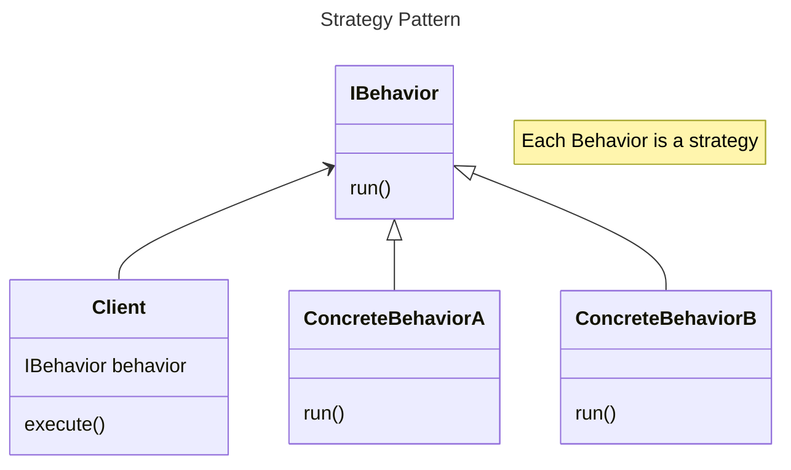

# Strategy Pattern
Strategy Pattern is a fundamental design pattern. It says value composition over inheritance.

Has-A relation > Is-A relation
### Formal Definition
The strategy pattern defines a family of algorithms, encapsulates each one, and makes them interchangeable. 
Strategy pattern lets the algorithm vary independently of the clients that use it.
### Relation with example
In the code, we can see that there are several duck entities. Each of the concrete duck classes inherit from the abstract duck class. 

Each duck has a different flying behavior and quacking behavior. If it is handled through inheritance, the issue will come when certain behaviors are given to the concrete classes through inheritance without the developer intending for that to happen. Further, the developer would have to keep overriding the behaviour for each of the implementing classes.

A better design is to use the Strategy Pattern. Here the "client" is a concrete duck class. The "family of algorithms" refers to the different behaviors a duck possesses. Each concrete behavior class, encapsulates within it, the implementation of that behavior.
The client is completely abstracted from the implementation of each behavior. All it cares about is that it is an implementation of the behaviour.

The abstract duck class is now composed of (composition) an instance of FlyBehavior and an instance of QuackBehavior. FlyBehaviour itself can have many implementations and same is the case for QuackBehaviour.
A concrete duck class that uses a combination of FlyBehaviour and DuckBehaviour will now be called a "Mallard Duck" or a "Rubber Duck".

### Advantages of Strategy Pattern
By using strategy pattern, we are able to decouple the client from the implementation. The behaviour can change in runtime and the developer need not make any changes to the code.
It delivers superior flexibility and minimizes code reuse.

Strategy pattern is favourable when behaviors are shared not Parent-Child in a heirarchy tree, but across siblings.

Each entity is represented as a composition of its behaviors. Each behavior can have different implementations and can be interchangeable.
